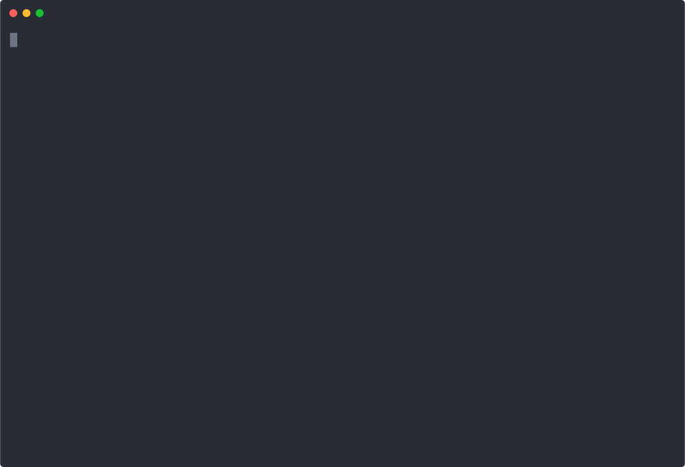

# progress-wrap

Wrap any command and get a live progress bar with ETA in your terminal.

```
[=======================================         ] 73.4%  ETA: 4m12s (16:47:23)  (avg velocity: 0.142%/s  accel: +0.001%/s²)
```

`progress-wrap` runs your command, captures its output, extracts a progress percentage, and prints a progress bar with an estimated completion time. State is persisted across invocations so the ETA improves over repeated runs of the same command.



The demo above shows `progress-wrap` wrapping a simulated command whose speed follows a sine-bell curve: it accelerates through the first half and decelerates symmetrically back to zero. The IMM estimator (default) detects the acceleration and deceleration in real time and adjusts its ETA accordingly.

## Installation

Pre-built binaries for Linux, macOS, and Windows are available on the
[Releases page](https://github.com/baruch/progress-wrap/releases/latest).

Or install with Go:

```bash
go install github.com/baruch/progress-wrap@latest
```

Or build from source:

```bash
git clone https://github.com/baruch/progress-wrap
cd progress-wrap
go build -o progress-wrap .
```

## Usage

```bash
progress-wrap [flags] <command> [args...]
```

### Idiomatic usage loop

`progress-wrap` is designed to be called repeatedly from a polling loop. Each invocation runs the status command, updates the persisted state, and prints one progress bar line. The loop below keeps a single bar visible on screen and appends every bar to a log:

```bash
while true; do
    progress-wrap myapp status | tee -a progress.log > .display
    clear
    cat .display
    sleep 30
done
```

### Basic examples

```bash
# Wrap a command that prints "Progress: 42%"
progress-wrap myapp status

# Use a JSON-outputting command with a jq expression
progress-wrap --parse-jq '.progress * 100' myapp status --json

# Use a regex to extract progress
progress-wrap --parse-regex 'Done: (\d+)%' myapp status

# Reset accumulated state before running
progress-wrap --reset myapp status
```

### Flags

| Flag | Default | Description |
|------|---------|-------------|
| `--state <path>` | `/tmp/progress-wrap.state.<cmd>` | Path to the JSON state file |
| `--reset` | false | Delete state before running |
| `--estimator <type>` | `imm` | ETA estimator: `imm`, `kalman`, or `ema` |
| `--ema-alpha <float>` | `0.2` | EMA smoothing factor (only used with `--estimator ema`) |
| `--parse-regex <pattern>` | — | Ad-hoc regex with one capture group returning a percentage |
| `--parse-jq <expr>` | — | Ad-hoc jq expression returning a percentage (0–100) |
| `--config <path>` | — | Path to a TOML parser config file |

`--parse-regex` and `--parse-jq` are mutually exclusive.

### Output format

Each invocation prints one line to stdout:

```
[bar]  <percent>%  ETA: <remaining> (<wall-clock>)  (avg velocity: <vel>%/s  accel: <accel>%/s²)
```

The bar width adapts to the terminal width. When stdout is a pipe, `progress-wrap` falls back to stderr, stdin, `/dev/tty`, the `$COLUMNS` environment variable, and finally 80 columns.

### State file

Progress samples and estimator state are persisted in a JSON file (default `/tmp/progress-wrap.state.<safe-command>`). This lets the ETA estimate improve across multiple runs of the same long-running operation. Use `--reset` to start fresh.

## ETA estimators

Three estimators are available via `--estimator`:

| Name | Description |
|------|-------------|
| `imm` (default) | Interacting Multiple Models Kalman filter. Runs two parallel models — stable (smooth, low noise) and transitioning (fast-reacting, high noise) — and blends them by likelihood. Handles sudden rate changes well. |
| `kalman` | Single 2D constant-velocity Kalman filter. Good for steady, predictable progress. |
| `ema` | Exponential moving average velocity. Simple and robust; use `--ema-alpha` to tune responsiveness. |

## Adding a new command parser

### Option 1: Built-in parsers (for commands you want supported by default)

Edit `parser/builtin/builtin_parsers.toml`. Entries are tested in order; the first `command_regex` that matches the full command string wins.

```toml
# Regex parser — capture group must return a percentage (0–100)
[[parsers]]
command_regex = '^myapp status'
type          = "regex"
pattern       = 'Completed:\s*(\d+(?:\.\d+)?)\s*%'
group         = 1   # which capture group holds the percentage (default: 1)

# jq parser — expression must evaluate to a number in 0–100
[[parsers]]
command_regex = '^myapp status --json'
type          = "jq"
expression    = ".result.done_pct"
```

Rules:
- `command_regex` is matched against the full command string (command + all args joined by spaces).
- An empty `command_regex` matches any command (use as a catch-all at the end of the file).
- More-specific entries should appear before less-specific ones.
- For `jq` parsers the expression must return a float in **0–100**. Use arithmetic if needed: `.fraction * 100`.

### Option 2: Per-user config file

Create a TOML file with the same schema and pass it via `--config`:

```toml
[[parsers]]
command_regex = '^rsync'
type          = "regex"
pattern       = '\s(\d+)%'
group         = 1
```

```bash
progress-wrap --config ~/.config/progress-wrap/parsers.toml rsync -av src/ dst/
```

Config-file parsers are tried before built-ins, so you can override built-in behaviour.

### Option 3: Inline on the command line

For a one-off parse without any config file:

```bash
# Regex
progress-wrap --parse-regex '\s(\d+)%' rsync -av src/ dst/

# jq (for JSON-outputting commands)
progress-wrap --parse-jq '.tasks.done / .tasks.total * 100' myapp jobs
```

These take the highest priority (before `--config` and before built-ins).

## How parsing priority works

```
--parse-regex / --parse-jq   (highest)
        ↓
--config file entries
        ↓
built-in parsers (builtin_parsers.toml)
        ↓
no match → warning printed, no progress bar
```

Within each source, entries are tested top-to-bottom and the first matching `command_regex` wins.
